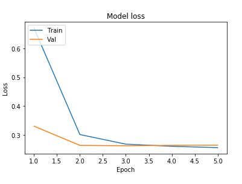
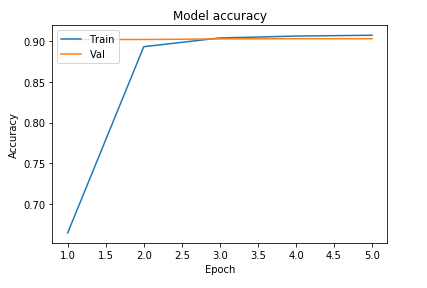

# Multilabel Movie Poster Classification

Multilabel image classification to classify movie poster and find appropriate movie genre with movie poster. For this project **tensorflow** framwork is used for deep learning model. The model is converted into **tf lite** to reduce final model size. This is a complete project with server side code and also fronted. To deploy deep learning model, **flask** is used and deployed into **heroku** server. By using **Flutter** framework frontend web app is developed and deployed into **firebase**.

**Notebook**: [Click here](https://github.com/Iamsdt/MultilabelMoviePosterClassification/blob/master/notebook/Multilabel_Image.ipynb)

**Web App**: [Movie Poster Classifier](https://flutter-web-3a021.firebaseapp.com/#/)


## AI model

Framework: Tensorflow 2.1

Datasets: [Movie_Poster_Dataset](https://www.cs.ccu.edu.tw/~wtchu/projects/MoviePoster/Movie_Poster_Dataset.zip)

### Classifier Architecture

**Input Shape**: (350, 350, 3)

**Label**: (24)

**Output Shape**: (24)

**Model Summary**

```
Model: "sequential"
_________________________________________________________________
Layer (type)                 Output Shape              Param #   
=================================================================
conv2d (Conv2D)              (None, 348, 348, 16)      448       
_________________________________________________________________
batch_normalization (BatchNo (None, 348, 348, 16)      64        
_________________________________________________________________
dropout (Dropout)            (None, 348, 348, 16)      0         
_________________________________________________________________
conv2d_1 (Conv2D)            (None, 346, 346, 32)      4640      
_________________________________________________________________
batch_normalization_1 (Batch (None, 346, 346, 32)      128       
_________________________________________________________________
max_pooling2d (MaxPooling2D) (None, 173, 173, 32)      0         
_________________________________________________________________
dropout_1 (Dropout)          (None, 173, 173, 32)      0         
_________________________________________________________________
conv2d_2 (Conv2D)            (None, 171, 171, 64)      18496     
_________________________________________________________________
batch_normalization_2 (Batch (None, 171, 171, 64)      256       
_________________________________________________________________
max_pooling2d_1 (MaxPooling2 (None, 85, 85, 64)        0         
_________________________________________________________________
dropout_2 (Dropout)          (None, 85, 85, 64)        0         
_________________________________________________________________
conv2d_3 (Conv2D)            (None, 83, 83, 128)       73856     
_________________________________________________________________
batch_normalization_3 (Batch (None, 83, 83, 128)       512       
_________________________________________________________________
max_pooling2d_2 (MaxPooling2 (None, 41, 41, 128)       0         
_________________________________________________________________
dropout_3 (Dropout)          (None, 41, 41, 128)       0         
_________________________________________________________________
flatten (Flatten)            (None, 215168)            0         
_________________________________________________________________
dense (Dense)                (None, 128)               27541632  
_________________________________________________________________
batch_normalization_4 (Batch (None, 128)               512       
_________________________________________________________________
dropout_4 (Dropout)          (None, 128)               0         
_________________________________________________________________
dense_1 (Dense)              (None, 128)               16512     
_________________________________________________________________
batch_normalization_5 (Batch (None, 128)               512       
_________________________________________________________________
dropout_5 (Dropout)          (None, 128)               0         
_________________________________________________________________
dense_2 (Dense)              (None, 24)                3096      
=================================================================
Total params: 27,660,664
Trainable params: 27,659,672
Non-trainable params: 992
```


### Hyperparameters

| Parameters    |                     |
| ------------- | ------------------- |
| Optimizer     | Adam                |
| Learning rate | 0.001               |
| Loss function | Binary Crossentropy |
| Batch size    | 32                  |
| Epoch         | 5                   |

### Training Logs

```
Train on 6854 samples, validate on 1210 samples
Epoch 1/5
6854/6854 [==============================] - 39s 6ms/sample - loss: 0.6711 - accuracy: 0.6647 - val_loss: 0.3302 - val_accuracy: 0.9021
Epoch 2/5
6854/6854 [==============================] - 34s 5ms/sample - loss: 0.3010 - accuracy: 0.8932 - val_loss: 0.2634 - val_accuracy: 0.9020
Epoch 3/5
6854/6854 [==============================] - 34s 5ms/sample - loss: 0.2676 - accuracy: 0.9039 - val_loss: 0.2620 - val_accuracy: 0.9027
Epoch 4/5
6854/6854 [==============================] - 34s 5ms/sample - loss: 0.2602 - accuracy: 0.9062 - val_loss: 0.2636 - val_accuracy: 0.9030
Epoch 5/5
6854/6854 [==============================] - 34s 5ms/sample - loss: 0.2555 - accuracy: 0.9072 - val_loss: 0.2640 - val_accuracy: 0.9030
```

### Loss & Accuracy Graph



### Output


### Model Conversion

Tensor flow model is converted into tf.lite. The main model size is 350 mb+, after convert into tf lite the final size ~ 55 mb+.

```python
converter = tf.lite.TFLiteConverter.from_keras_model(net)
tflite_model = converter.convert()
```

This conversion reduce model size into ~110 mb.

Next, Float32 converted into Float 16.

```
converter.optimizations = [tf.lite.Optimize.DEFAULT]
converter.target_spec.supported_types = [tf.float16]
tflite_fp16_model = converter.convert()
```

And saved optimized model

```
tflite_model_fp16_file = tflite_models_dir/"movie_optimized.tflite"
tflite_model_fp16_file.write_bytes(tflite_fp16_model)
```

Now model size is 55.00 mb

Compare outputs between 3 models (tensorflow model, tflite model, tflite optimized model)

```
Output from tensorflow model:, War, Action, News
Output from tensorflow lite model:, War, Action, News
Output from tensorflow lite optimized model:, War, Action, News
```

### Notebook link: [Click here](https://github.com/Iamsdt/MultilabelMoviePosterClassification/blob/master/notebook/Multilabel_Image.ipynb)


## Web Server


For deploying model **Flask** is used

Used libraries

```
tensorflow
numpy
Flask==1.1.1
gunicorn==20.0.4
Pillow
flask-cors
```

Server accept **post** request with image bytes as data and return the predicted values in **json** format.

```
@app.route('/analysis/', methods=['POST', 'GET'])
def analysis():
    if request.method == 'POST':
        img = request.data
        response = predict(img)
        data = {
            "result": response
        }
        return jsonify(
            data)
```

#### Server link: https://rocky-beyond-88001.herokuapp.com/analysis


## Webapp


For frontend web app, **Flutter web framework** is used

### Flutter Version: 

**Flutter 1.15.19**

**Dart 2.8.0**

### Used Libraries

```
http: ^0.12.0+4
html: ^0.14.0+3
retrofit: ^1.3.1+1
logger: ^0.8.3
states_rebuilder: ^1.14.2
json_annotation: ^3.0.1
url_launcher: ^5.4.2
```

Website deployed in **Firebase**

#### Web app link: [Movie Poster Classifier](https://flutter-web-3a021.firebaseapp.com/#/)
<br/>

### Web App Screenshot


## Want to run locally?

Clone this repo

```
git clone https://github.com/Iamsdt/MultilabelMoviePosterClassification.git
```

For **AI model** see this notebook, [click here](https://github.com/Iamsdt/MultilabelMoviePosterClassification/blob/master/notebook/Multilabel_Image.ipynb)

**Server side code**: all the server side code including model file located into **server** folder

**Flutter Web App**: Located into **app/web_app**

Open in the IDE with flutter plugin and run this command, to generate

```
flutter run -d chrome
```

Note: you need chorme web browser to run locally.

<br/>

## License

This project is under [Apache License 2.0](https://github.com/Iamsdt/MultilabelMoviePosterClassification/blob/master/LICENSE).

```
Copyright {2020} {Shudipto Trafder}

Licensed under the Apache License, Version 2.0 (the "License");
you may not use this file except in compliance with the License.
You may obtain a copy of the License at

       http://www.apache.org/licenses/LICENSE-2.0

Unless required by applicable law or agreed to in writing, software
distributed under the License is distributed on an "AS IS" BASIS,
WITHOUT WARRANTIES OR CONDITIONS OF ANY KIND, either express or implied.
See the License for the specific language governing permissions and
limitations under the License.
```